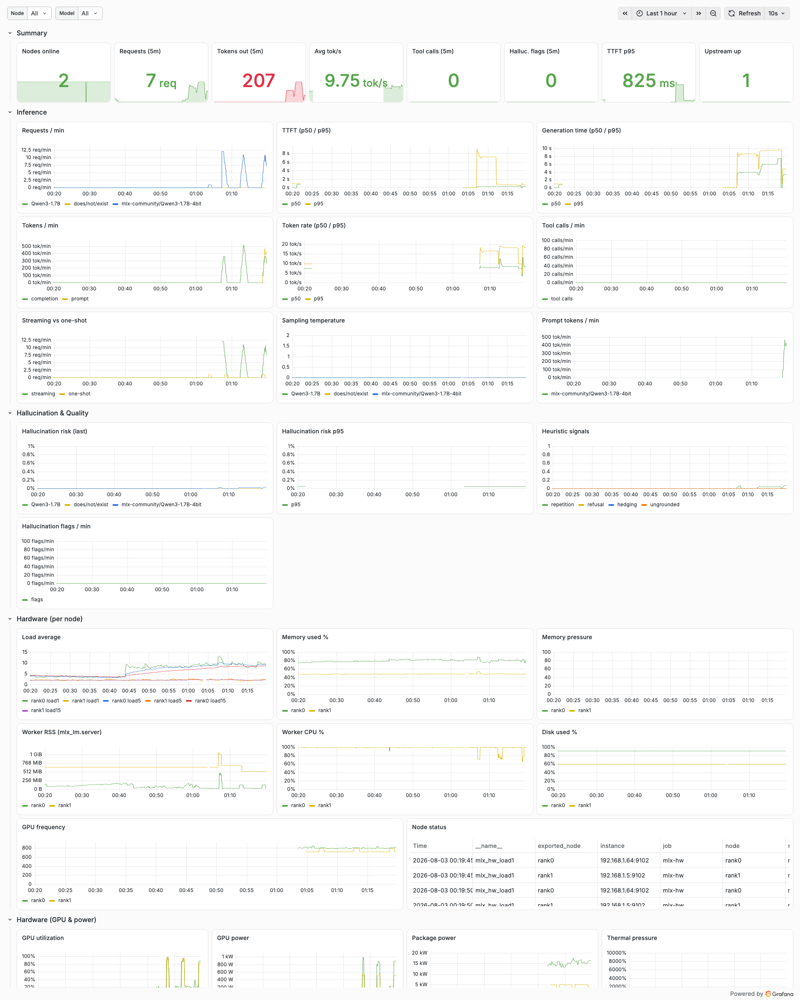
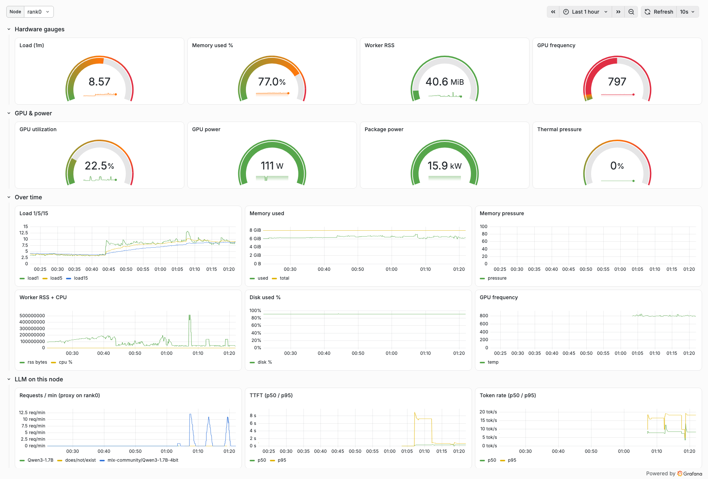

# mlx-oc

Distributed MLX LLM inference on a two-Mac-mini cluster, fronted by a
Prometheus/OpenTelemetry-observable proxy, with a full
VictoriaMetrics + Grafana observability stack running locally on podman.

```
clients (opencode / curl)
        │  OpenAI-compatible API
        ▼
mlx_metrics_proxy.py :8080 ──► mlx_lm.server :8081 (ring: rank0 + rank1)
        │   /metrics (Prometheus text)
        │   OTLP traces+metrics+logs ──► otel-collector ──► VictoriaMetrics ──► Grafana
        ▼
mlx_hw_telemetry.py :9102  per-node CPU / RAM / disk / temp (both nodes)
```

## Stack

| Piece | Where | Port | What it does |
|---|---|---|---|
| `mlx_lm.server` | both nodes (rank 0 + rank 1) | 127.0.0.1:8081 | distributed inference via the `ring` backend (`mlx.launch --backend ring`) |
| `cluster/mlx_metrics_proxy.py` | rank 0 | 0.0.0.0:8080 | OpenAI-compatible front door; records TTFT, token rate, temperature, tool calls, hallucination-risk heuristics |
| `cluster/mlx_hw_telemetry.py` | both nodes | 0.0.0.0:9102 | hardware telemetry (load, memory pressure, disk, worker CPU/RSS, CPU temp, GPU util/power, package power, thermal pressure) |
| `cluster/start_server.sh` / `stop_server.sh` | rank 0 | – | launch / tear down the whole stack |
| `observability/compose.yaml` | podman (rank 0) | 8428 / 4317 / 4318 / 3000 | VictoriaMetrics + otel-collector + Grafana |

Model: `mlx-community/Qwen3-1.7B-4bit` (change `MODEL` in `start_server.sh`).

## Quick start

```bash
./cluster/start_server.sh        # launches server (both nodes), proxy, hw agents
curl -s http://127.0.0.1:8080/v1/models
curl -s http://127.0.0.1:8080/metrics | head
curl -s http://127.0.0.1:9102/metrics | grep mlx_hw_load1
./cluster/stop_server.sh         # tears everything down
```

Any OpenAI-compatible client works against `http://<rank0-ip>:8080/v1` —
e.g. `opencode` pointed at `http://192.168.1.64:8080/v1/chat/completions`.

## Benchmarks

Measured with `tools/bench.py` against `Qwen3-1.7B-4bit` (temp 0.0, 3 iters).
The 2-node ring is `~3×` slower than a single Mac for this tiny model — the
ring collectives dominate at 1.7B parameters. Distribution pays off only when
the model is too big for one node's memory.

| Metric | Single node | 2-node ring | Ratio |
|---|---|---|---|
| **TTFT (time to first token)** | <span style="color:#0f766e">~0.1–0.2s</span> | <span style="color:#b45309">~0.2s</span> | 1–2× |
| **Short prompt (~40 tokens out)** | <span style="color:#0f766e">0.8s · ~65 tok/s</span> | <span style="color:#b45309">2.4s · ~18 tok/s</span> | ~3× |
| **Medium prompt (~70 tokens out)** | <span style="color:#0f766e">2.0–3.4s · ~32 tok/s</span> | <span style="color:#b45309">6.9s · ~10 tok/s</span> | ~3× |
| **Long prompt (~90 tokens out)** | <span style="color:#0f766e">2.1–3.9s · ~44 tok/s</span> | <span style="color:#b45309">7.0s · ~12 tok/s</span> | ~3× |
| **256-token cap (medium/long)** | <span style="color:#0f766e">3.4–3.9s · ~36–44 tok/s</span> | <span style="color:#b45309">13.9–14s · ~11 tok/s</span> | ~3.5× |

**Concurrency burst** (4 clients, 12 requests total, `--max-tokens 256`):

| Configuration | Wall time | Mean per-request | Aggregate throughput |
|---|---|---|---|
| Single node | <span style="color:#0f766e">26.8s</span> | 8.9s | <span style="color:#0f766e">~51.5 tok/s</span> |
| 2-node ring | <span style="color:#b45309">61.6s</span> | 20.5s | <span style="color:#b45309">~23.6 tok/s</span> |

Run them yourself:

```bash
.venv/bin/python tools/bench.py --base http://127.0.0.1:8080/v1 \
  --model mlx-community/Qwen3-1.7B-4bit --iters 3 --label "2-node ring"

.venv/bin/python tools/bench.py --concurrency 4 --max-tokens 256 \
  --iters 5 --label "4-way burst"
```

## Metrics (Prometheus)

Proxy `/metrics` (`--metrics-path`):

* `mlx_requests_total{model,streaming}`
* `mlx_ttft_seconds` (histogram), `mlx_gen_seconds`, `mlx_token_rate_tokens_per_second`
* `mlx_tokens_prompt_total`, `mlx_tokens_completion_total`
* `mlx_temperature`, `mlx_tool_calls_total`
* `mlx_hallucination_risk{model}` gauge + `mlx_hallucination_risk_histogram_bucket`
* `mlx_upstream_up`

Hardware agent `/metrics` (each node, `--node-name`):

* `mlx_hw_up`, `mlx_hw_uptime_seconds`, `mlx_hw_load{1,5,15}`, `mlx_hw_cpu_count`
* `mlx_hw_cpu_temp_celsius` (best effort; `NaN` when powermetrics/sudo unavailable)
* `mlx_hw_mem_total_bytes`, `mlx_hw_mem_used_bytes`, `mlx_hw_mem_pressure`
* `mlx_hw_disk_total_bytes`, `mlx_hw_disk_used_bytes`
* `mlx_hw_gpu_utilization_percent`, `mlx_hw_gpu_frequency_mhz`, `mlx_hw_gpu_power_milliwatts` (powermetrics, ~15 s cadence; `NaN` when sudo/powermetrics unavailable)
* `mlx_hw_package_power_milliwatts` (combined CPU + GPU + ANE)
* `mlx_hw_thermal_pressure` (0..1 from `pmset -g therm`; no sudo needed)
* `mlx_worker_cpu_percent`, `mlx_worker_rss_bytes` (matches `mlx_lm.server`)

Proxy `/metrics` runtime gauges:

* `mlx_in_flight{model}` — currently executing requests
* `mlx_error_total{model,status}` — counter of 4xx/5xx responses

## Observability (VictoriaMetrics on podman)

`observability/compose.yaml` runs three containers on rank 0 with podman:

| Container | Port | Role |
|---|---|---|
| `victoria-metrics` | :8428 | TSDB + scraping; Prometheus-compatible API (`/vmui`) |
| `otel-collector` | :4317 gRPC / :4318 HTTP | OTLP receiver → `prometheus_remote_write` → VM |
| `grafana` | :3000 | dashboards, auto-provisioned (login `admin` / `admin`) |

Start it (once — generates `vm-scrape.yml` from the template with your IPs):

```bash
cd observability
./setup.sh                      # writes vm-scrape.yml (edit VM's machine IPs if needed)
podman compose up -d            # or: podman-compose up -d
```

Check it:

```bash
open http://localhost:8428/vmui      # VictoriaMetrics query UI
open http://localhost:3000           # Grafana → "MLX Cluster" dashboard
curl -s http://localhost:8428/api/v1/query?query=mlx_requests_total
```

Two paths feed the TSDB:

1. **Prometheus scraping** — VM scrapes `mlx-proxy` (:8080) and both
   `mlx-hw` agents (:9102 on rank0 + rank1) every 15s.
2. **OTLP push** — the proxy and hw agents export traces/metrics/logs to
   `http://<rank0-ip>:4318`; the collector converts and remote-writes to VM.

VM's remote-write name for an OTLP counter `mlx.requests` is
`mlx_requests_total`; the OTel `service.name` becomes the `service_name` label.

### Dashboards

Grafana auto-provisions two dashboards from `observability/grafana/dashboards/`
(`MLX Cluster` — cluster-wide inference + hardware rows including GPU
utilization/power from powermetrics, `MLX Node` — drill into a single node with
GPU/power gauges and thermal pressure).





## OpenTelemetry

Pass `--otlp-endpoint` to the proxy and/or hw agent to enable OTLP export
(HTTP). `MLX_OTLP_ENDPOINT` is read as the default, and `start_server.sh`
defaults to `http://192.168.1.64:4318` (the local podman collector). The
endpoint must be a base URL — the exporter appends `/v1/traces`, `/v1/metrics`
and `/v1/logs` itself.

```bash
cluster/mlx_metrics_proxy.py \
  --listen 0.0.0.0:8080 --upstream 127.0.0.1:8081 \
  --node-name rank0 --otlp-endpoint http://192.168.1.64:4318

cluster/mlx_hw_telemetry.py \
  --node-name rank1 --listen 0.0.0.0:9102 \
  --otlp-endpoint http://192.168.1.64:4318
```

Each request becomes a `mlx.chat.completions` span carrying
`mlx.ttft_seconds`, `mlx.gen_seconds`, token counts, tool calls,
hallucination risk and HTTP status.

## Known platform quirks

* **macOS Local-Network privacy (TCC)**: on node B the third-party Homebrew
  `python3.14` binary is silently blocked from reaching local subnets over
  SSH (instant `EHOSTUNREACH`). The distributed server and node-B telemetry
  therefore run on the py3.12 venv `~/venvs/mlx`; the local (rank 0) proxy
  runs on the py3.14 venv `.venv` at the repo root. Both venvs carry identical
  `mlx 0.32.0` / `mlx-lm 0.31.3`.
* **CPU temperature** requires `powermetrics` via passwordless sudo; the
  sensor name differs per Apple Silicon generation, so this is best-effort
  and falls back to `NaN`.
* **Ring hostfile**: `cluster/hosts.json` (rank 0: `10.0.0.1`) and the auto-
  generated hostfile used on the remote (`cluster/hosts_rev.json`, rank 1:
  `10.0.0.2`). Update both if the cluster IPs change.
* **SSE streaming**: the proxy uses `resp.read1()` so it never blocks on a
  full 64 KiB buffer before relaying chunks — without it TTFT looks like the
  whole generation time.

## Layout

```
cluster/mlx_metrics_proxy.py    metrics + OTel proxy in front of mlx_lm.server
cluster/mlx_hw_telemetry.py     per-node hardware telemetry exporter
cluster/start_server.sh         launch ring server, proxy, hw agents (both nodes)
cluster/stop_server.sh          stop the above
cluster/hosts.json              ring hostfile (rank 0 side)
cluster/hosts_rev.json          ring hostfile (rank 1 side)
cluster/logs/                   runtime logs (server, proxy, hw agents)
tools/bench.py                  streaming TTFT / token-rate / concurrency bench
tools/agent.py, smoke.py        distributed tool-loop demo, ring connectivity test
observability/compose.yaml      victoria-metrics + otel-collector + grafana (podman)
observability/setup.sh          generate vm-scrape.yml (scrape targets from your IPs)
observability/otelcol-config.yaml   OTLP → prometheus_remote_write → VM
observability/grafana/          auto-provisioned datasource + MLX Cluster dashboard
```
